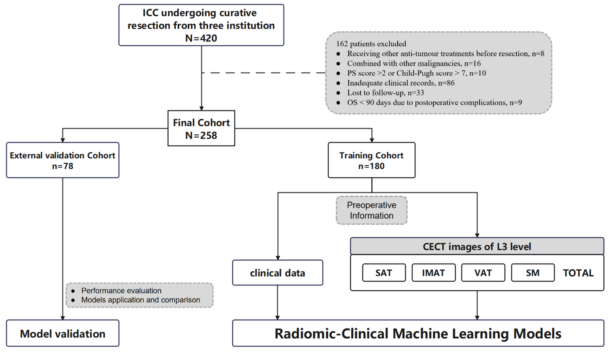

# Body Composition Analysis Pipeline



## Ethics and Compliance
<details>
<summary><strong>⚠️ Data Usage Disclaimer</strong></summary>

> **Data Declaration**  
> This code repository contains no real patient data. Actual data must be obtained by users independently and used in compliance with applicable local ethical regulations including but not limited to HIPAA, GDPR, and institutional IRB requirements.
</details>

## Data Input Specifications
- **Format**: Microsoft Excel (`.xlsx`) in "model" folder
- **Required Columns**:
  | Column Name         | Data Type    | Description                     |
  |---------------------|--------------|---------------------------------|
  | `radiomics_features`| Numeric      | Image-derived biomarkers        |
  | `clinic_features`   | Numeric      | Clinical measurements           |
  | `Group`             | Categorical  | Experimental cohort assignment  |

Read the information from the image feature files, such as pixel size, voxel space, and mask label values.
Read the directory structure:
## 📁 Data Requirements
### Directory Structure
```plaintext
Project/
├── NRRD/                          # Primary imaging data
│   ├── P001/                      # Anonymized patient ID
│   │   ├── CT.nrrd                # Axial CT scan (required)
│   │   ├── Segmentation.seg.nrrd  # Segmentation mask (required)
│   ├── P002/
│   │   ├── ...
├── model/
│   ├── clinical_data.xlsx         # Clinical dataset


Calculate the distribution of Hounsfield Unit (HU) values and plot a histogram for observation.

Perform image resampling and grayscale value correction.

Extract features.（Use python3.7.1 pyradiomics）

Calculate the consistency of feature variables and eliminate those with intra-group or inter-group consistency below 0.75.

Select appropriate feature variables to include in the model (using MRMR).

Adjust the hyperparameters of the model and screen for better-performing models.

Plot the variable importance graph of the optimal model and generate evaluation result images.

